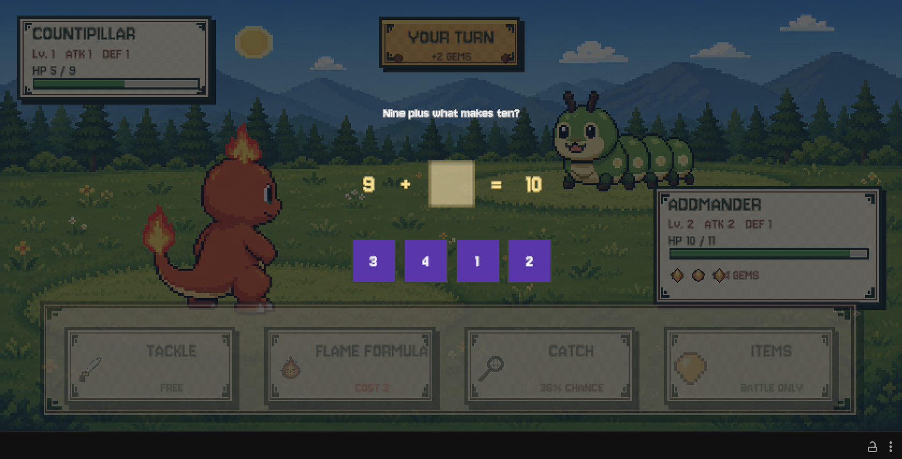

# Numeria 🔢✨

**A Pokémon-inspired math RPG built for a five-year-old.** In Numeria, numbers, shapes, symmetry, and patterns
are magic. Players befriend original creatures called **Mathmons**, solve Kindergarten-level puzzles to power
their skills, and help Lucas restore six Digit Crystals so he can reopen the legendary gate home.

> Current state: a playable six-region Unity build with story, exploration, battles, catching, evolution,
> economy, shops, saves, offline narration, and 141 Mathmon forms. iOS/TestFlight work has not started.



## Current development status

| Milestone | Status | What is available |
|---|---|---|
| P0 — Project foundation | ✅ Complete | Repository, Unity project, asset pipelines |
| P1 — Battle core | ✅ Complete | Skills, gems, number shields, ATK/DEF combat, VFX, narration |
| P2 — Forest vertical slice | ✅ Complete | Exploration, encounters, catching, growth, chests, saving |
| P3 — Full game systems | 🔶 Playable / polishing | Six painterly worlds, 141 Mathmons, evolution, economy, merchants, Lucas story |
| P4 — iOS delivery | ⬜ Not started | Device build, signing, TestFlight and final performance QA |

The current verification baseline compiles all four Unity assemblies and passes **121/121 Unity EditMode tests**
plus **15/15 Node prototype tests**.
The save format is currently **schema v9**, with non-destructive migration for older saves.

## Design principles

- **Math is magic, not a test.** Problems appear as spells, crystal patterns, treasure locks, and world runes.
- **Zero punishment for mistakes.** A wrong answer never damages the player. Skills still use their base power,
  and the game provides another visual explanation or retry.
- **Understandable without fluent reading.** Questions, story dialogue, catches, evolution, shops, and feedback
  use pre-baked English narration rather than online text-to-speech.
- **Small, child-readable numbers.** HP, gems, damage, coin rewards, prices, and puzzle answers stay within
  intentionally understandable ranges.
- **Original world and creatures.** Numeria takes structural inspiration from creature-collection RPGs but uses
  original Mathmons, characters, artwork, skills, progression, and fiction.

## Implemented gameplay

### Battle and Mathmons

- 141 Mathmon forms across 48 evolution families, with independent level, XP, HP, ATK, and DEF growth to Lv. 99.
  The newest 16 three-stage families add four Electric, four Rock, four Dragon, and four Fire lines.
- The original eleven families retain distinct skills, while each new elemental group has its own generated icon,
  palette, and battle performance.
- Number shields, shield-break stun, gems, powered math skills, consumable items, and equippable accessories.
- Every shield break independently arms one clearly labeled **2× next hit** bonus, including second and later cycles.
- Damage uses `max(1, ATK - DEF + 1 + [-1, 1])`; enemy HP also has controlled per-encounter variation.
- Bosses have higher region-scaled HP and number shields without becoming mandatory difficulty walls.

### Catching and team management

- Catch can be attempted at any remaining HP.
- Success follows a health-based curve from roughly **10% at full HP to 95% near zero HP**.
- The traveling team holds at most **99 Mathmons**.
- If a catch would exceed the limit, the player chooses whether to release the newcomer or replace an existing
  companion. Addmander remains the protected starter, and released companions return equipped accessories.
- Any non-starter companion can also be released from TEAM for either coins or Battle Buddy XP. Rewards rise at
  every level: `coins = level + 2`, `XP = level x 2 + 4`; equipped accessories always return to ITEMS.
- A caught Mathmon keeps its wild level, evolution form, and exact battle HP/ATK/DEF. Individual stat offsets
  remain attached through later growth and saves. When a stronger member of an owned family is caught, the player
  chooses between adopting it or converting the catch into **125% of the normal catch XP**.

### Exploration and economy

- Six large, pathfinding-based worlds use the actual square tiles from `Tiles and Hexes: 2D Painted Terrain
  Samples`. The renderer normalizes the pack's bottom-anchored 256×384 artwork to the gameplay grid and sorts lower
  screen rows in front, so forests, snowy pines, mountains, castles, cacti, oceans, and volcanoes keep their painted
  depth. Each chapter has its own palette and terrain mix; narrow translucent route overlays keep roads readable
  without replacing the painted ground. Water, cliffs, bridges, landmarks, treasure, and exits remain semantic
  gameplay tiles rather than interchangeable decoration.
- Four visible math-discovery runes per map. Solving their themed puzzle awards one-time coins and occasional
  battle items; incorrect answers leave the discovery available for another attempt.
- Ordinary enemies, merchant challenges, and bosses award region-scaled coins.
- Every region has an original merchant character. Defeat their trained Mathmon to unlock a permanent shop with
  limited quantities of consumables, balanced accessories, and evolution stones.
- Treasure chests, weighted regional ecosystems, item drops, evolution trials, and three-part portal trials.

### Story and presentation

- A title screen with **Start a New Game** and **Load Game**, ten-slot selection, overwrite confirmation, and a
  narrated introduction starring Lucas and Addmander.
- Lucas explores Numeria while the selected Mathmon remains the active battle companion.
- Elder Rowan, Keeper Orin, Astronomer Lyra, Sage Solara, Engineer Vesper, and Keeper Echo guard the six Digit Crystals.
- Guardian conversations appear before and after each boss, leading to a six-crystal ending while leaving free
  exploration available.
- TEAM, ITEMS, RECORDS, SAVES, and SETTINGS menus; ten independent save slots and a save-aware return-to-menu flow.
- Unified TextMeshPro/Jersey 10 typography, generated pixel-art characters and icons, ten SFX cues, and nine
  mood-based 8-bit music tracks with crossfading and narration ducking.

## Kindergarten math progression

| Region | Number range | Puzzle progression | Boss |
|---|---:|---|---|
| 🌲 Mystic Forest | 0–10 | Addition, subtraction, counting, comparison, shapes, colored AB patterns, number paths | Numberfly |
| ⛰️ Silent Peaks | 0–20 | Harder arithmetic, make-target, three-term sums, equality balance, pattern gaps | Duplirock Elder |
| ☁️ Azure Sky City | 0–30 | Four-term sums, geometry, mirror-order matching, number paths/sequences, mixed patterns | Symmetrix |
| 🏜️ Fever Desert | 0–40 | Larger arithmetic, selective shape/color matching, equality balance, advanced mixed patterns | Solar Totalisk |
| ⛏️ Dark Mines | 0–40 | Multi-step review, factor-like grouping, circuit sequences, mirrored routes | Master Voltamper |
| 🔥 Underground Tunnels | 0–40 | Cumulative arithmetic, symmetry, equality, mixed pattern mastery | Ancient Calcularagon |

Portal trials always include arithmetic, use three different puzzle families, and allow unlimited zero-penalty
retries.

## Run the Unity game

Requirements:

- Unity **6000.5.6f1**
- Unity Input System and TextMeshPro packages restored by the project
- macOS, Windows, or another Unity Editor-supported development host

Steps:

1. Open the [`unity/`](unity/) directory as a Unity project.
2. Open `Assets/Scenes/SampleScene.unity`.
3. Press **Play**. `BattleBootstrap` constructs the map and UI at runtime; the scene intentionally contains no
   hand-authored gameplay hierarchy.

### Install the licensed 8-bit soundtrack

The licensed **The 8-bit Jukebox Lite** source package and synchronized runtime WAVs are intentionally excluded
from Git. After importing the package at
`unity/Assets/Cyberleaf Music - The 8-bit Jukebox Lite`, run:

```bash
zsh tools/install-jukebox-music.sh
```

The installer maps nine local tracks to six regions plus battle, boss, and evolution moods. Attribution and
the exact track list are documented in [`docs/music-attribution.md`](docs/music-attribution.md).

### Install the licensed map art

All six chapters use **Tiles and Hexes: 2D Painted Terrain Samples**. Its Asset Store source PNGs are excluded from
Git rather than redistributed as a standalone art pack. **RPG Worlds Caves** and **Tiny Swords** remain optional
legacy fallbacks only; neither is selected when the Painted Terrain catalog is complete.

1. Import Tiles and Hexes into the default `unity/Assets/Terrain Tile Hex Samples` directory.
2. In Unity, run **Numeria → Rebuild Map Asset Catalogs**.
3. Optionally run **Numeria → Export Map Previews** to render all six complete maps to
   `/tmp/numeria-map-previews` for visual review.

The generated catalog stores Unity object references only. Third-party source files remain ignored, while runtime
selection, semantic layouts, route rendering, and tests stay version-controlled.

## Run the Web battle prototype

The dependency-free Web prototype remains useful for quickly checking the original battle loop:

```bash
cd prototype
python3 -m http.server 8765
# Open http://localhost:8765
```

Its core loop is: use a free attack to gain gems → solve make-target math to break the number shield → solve a
formula such as `3 + □ = 7` to release a powered skill.

## Tests

Web prototype tests require Node.js 18 or newer and no installed packages:

```bash
npm test
```

Unity EditMode tests, with the Unity Editor closed:

```bash
/Applications/Unity/Hub/Editor/6000.5.6f1/Unity.app/Contents/MacOS/Unity \
  -batchmode \
  -projectPath "$(pwd)/unity" \
  -runTests \
  -testPlatform EditMode \
  -testResults /tmp/numeria-tests.xml \
  -logFile /tmp/numeria-tests.log
```

## Repository layout

| Path | Purpose |
|---|---|
| [`unity/`](unity/) | Main Unity game, runtime resources, and EditMode tests |
| [`prototype/`](prototype/) | Dependency-free Web battle prototype and Node tests |
| [`tools/`](tools/) | Voice, music, sprite export, and image-processing pipelines |
| [`docs/numeria-game-design.md`](docs/numeria-game-design.md) | Core game and curriculum design |
| [`docs/main-story.md`](docs/main-story.md) | Lucas and the Digit Crystals story structure |
| [`docs/economy-design.md`](docs/economy-design.md) | Coin rewards, shop stock, pricing, and balance rationale |
| [`docs/elemental-expansion.md`](docs/elemental-expansion.md) | Capture upgrades, 20 new families, and Fever Desert design |
| [`docs/generated-visual-assets.md`](docs/generated-visual-assets.md) | Image-generation prompts and production asset locations |
| [`docs/music-attribution.md`](docs/music-attribution.md) | 8-bit Jukebox track mapping and credits |
| [`docs/HANDOFF.md`](docs/HANDOFF.md) | Detailed engineering status and maintenance notes |

## Technical overview

- **Unity 2D / C#** with a pure `Numeria.Core` logic assembly and a programmatic UGUI/TMP presentation layer.
- Deterministic injected RNG for battles, encounter generation, rewards, and puzzle tests.
- Breadth-first pathfinding over semantic ASCII-authored maps (`~` water, `=` road, `B` bridge, `#` cliff,
  `L` landmark), rendered through a chapter-aware Painted Terrain layer with optional legacy fallbacks.
- Local JSON saves in `Application.persistentDataPath`, ten slots, and explicit schema migration.
- Convention-based `Resources` loading with generated-art fallbacks and automatic pixel-art import settings.
- Offline Samantha narration WAVs, independent voice/SFX/music settings, and mood-based music crossfades.

## Remaining roadmap

- Continue visual QA and layout polishing on real 4:3 iPad resolutions.
- Move hard-coded species/map balance data into validated JSON.
- Add adaptive difficulty and transformed retries based on puzzle-family mastery.
- Add a parent-gated progress dashboard.
- Complete iOS landscape settings, device profiling, signing, and TestFlight distribution.

---

*Made with ❤️ for a little math wizard.*
