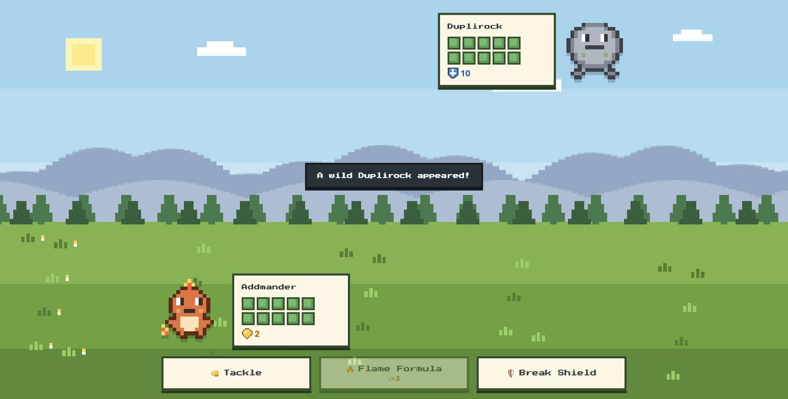

# Numeria 🔢✨

**A Pokémon-style math RPG for my 5-year-old** — in the land of Numeria, numbers and shapes *are* magic. Solve math puzzles to cast powerful spells, break enemy shields, unlock treasure chests, and evolve your Mathmon companions.



## 核心理念

- **数学是魔法,不是测验**:谜题以咒语、封印、符文锁的形式存在于世界观内,没有"跳出游戏做题"的时刻
- **零惩罚**:答错不掉血不受罚,技能仍以基础威力释放;十格阵数块动画引导重试。数学永远是加成,不是门槛
- **三层融入**:环境浸泡(十格阵 HP、数金币)→ 决策层(能量宝石心算)→ 高潮层(咒语算式、凑十破盾)
- **英文语音旁白**:题目全程朗读("Three plus what makes seven?"),不依赖识字量

## 项目结构

| 路径 | 内容 |
|---|---|
| [`docs/numeria-game-design.md`](docs/numeria-game-design.md) | 游戏设计文档(玩法、题型库、15 只数灵、三地图、自适应难度) |
| [`docs/unity-roadmap.md`](docs/unity-roadmap.md) | Unity/iOS 开发路线图(P0–P4) |
| [`prototype/`](prototype/) | 已验证的 Web 战斗原型(像素美术、战斗特效、语音、单元测试) |
| `unity/` | Unity 工程(建设中) |

## 试玩 Web 原型

```bash
cd prototype && python3 -m http.server 8765
# 打开 http://localhost:8765(iPad 同一 Wi-Fi 下访问 http://<Mac的IP>:8765)
```

核心玩法:普攻攒宝石 → 凑十法击碎数字护盾(2 回合双倍伤害)→ 咒语算式 `3 + □ = 7` 拖数字水晶释放大招。

## 测试

```bash
npm test   # Node ≥ 18,零依赖(node --test)
```

## 技术栈

- **原型**:Vanilla JS / Canvas 像素渲染 / Web Speech API,零依赖零构建
- **正式版**:Unity (2D URP) → iOS,纯 C# 逻辑层 + JSON 数据驱动(DLC 友好)

## 三张地图 = 三档难度

| 地图 | 数学主题 |
|---|---|
| 🌲 神秘森林 | 10 以内加减、点数、数量比较 |
| ⛰️ 静寂山脉 | 20 以内加减、凑十法、连加、翻倍 |
| ☁️ 蔚蓝天空城 | 图形规律、对称、旋转、序列 |

---

*Made with ❤️ for a little math wizard.*
