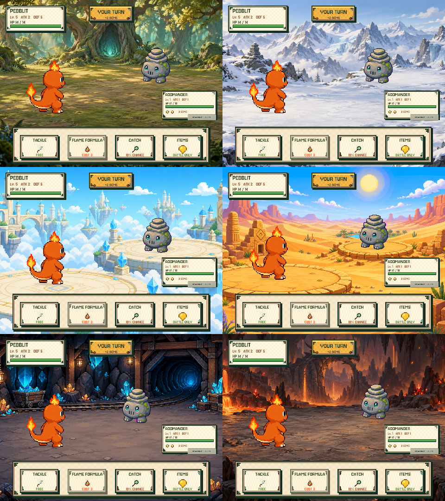

# Battle background alignment and biome art

Date: 2026-09-11 (local). Follow-up to the six-background audit.

## Changes

- All six battle panoramas now use aspect-preserving cover/crop, not a 16:9 image squeezed into 4:3.
- `BattleStageLayout` projects per-scene foot coordinates through the actual background crop. It handles canvas
  resizing, keeps combatants clear of the command dock/status card, and adds non-interactive contact shadows.
- The player status card is reduced to 78% scale and kept above the dock to expose more of the opponent platform.
- `GroundedBattleImage` aligns the visible sprite mesh to the foot baseline, including aspect changes on Mega swaps.
  Layout updates only on viewport changes, so ordinary rendering does not reset ongoing spell motion.
- Forest is now an ancient oak glade with fireflies and filtered sunlight, matching the woodland exploration theme.
- Underground is now a basalt/lava cavern with a dragon-shaped rock arch, replacing the purple temple theme.
- Desert keeps its existing pixel-painted dunes, ruins and oasis. Its two platforms were moved up/left through an
  ImageGen edit, because moving only the actor left it off-platform or behind the UI.
- Sky city and mines retain their current art. Snow retains the previously accepted panorama.
- No Core logic, stats, progression, save schema or real save slots changed. Old assets remain available for rollback.

## Verification

**Numeria → Preview All Battle Backgrounds** renders fresh in-memory battle data at 1920×1080, 1440×1080 and
2048×992, plus Mirrorwyrm and a Mega/fire sample. Outputs are under `/tmp/numeria-world-presentation`.
The same `BattleController` and stage layout are used in runtime and editor previews; no real slot is loaded.

New tests check cover ratio/coverage, actor/dock/status separation for all six maps at three ratios, repeated layout
stability, new asset routing/import and normal/Mega sprite-mesh foot alignment. **151/151 Unity EditMode tests**
and **15/15 Node prototype tests** passed.
Physical iPad touch, performance, full gameplay and audio have not been retested this round.

[Forest full-size](images/battle-forest-aligned.png) · [Underground full-size](images/battle-underground-aligned.png) ·
[Desert platform alignment on 4:3](images/battle-desert-aligned-4x3.png)

## Assets and exact prompts

All three images use built-in ImageGen, not a CLI/API fallback. Originals were copied into the repository; the
previous images were retained. No generated text or UI is baked into the art.

### Mystic Forest

`unity/Assets/Resources/generated/Backgrounds/Painted/Mystic_Forest.png`

Use case: stylized-concept. Production opaque 16:9 landscape background for Numeria, a friendly 2D creature-battle RPG. Beautiful polished hand-painted storybook fantasy, crisp textured brushwork, readable silhouettes, atmospheric depth, not photography, not blocky pixel art. Environment ONLY, no creatures, people, UI, text, numbers, watermarks or borders. Slightly elevated side-on battle camera, not an overhead map. Continuous spacious flat floor for combat: foreground resting point at x27%, y67% from top; opponent resting point at x65%, y49%. No obstacles or bright hotspots at those points. Lower24% and rightmost28% below y55% covered by UI; make regional identity visible in the center/upper middle. Clear diagonal corridor for spells. No floating circular discs. Mystic Forest: an ancient enchanted oak woodland glade enclosed by huge twisting old oaks with emerald and golden leaves, mossy roots at outer edges, a great hollow oak with a restrained turquoise inner glow in middle distance at x47%, firefly motes near foliage, shafts of warm afternoon sunlight through leafy canopy, layered cool teal forest haze. The battle floor is broad soft moss and packed earth under dappled light. Ferns and tiny woodland flowers only at edges. This feels like being INSIDE an intimate magical forest, not open meadow, not pine mountains. Warm welcoming mysterious atmosphere suitable for a five year old, never scary. Keep floor relatively quiet and midtone so small characters remain clear.

### Underground Tunnels

`unity/Assets/Resources/generated/Backgrounds/Painted/Underground_Tunnels.png`

Use case: stylized-concept. Production opaque 16:9 landscape battle background for Numeria, a friendly 2D fantasy creature RPG. Beautiful polished hand-painted storybook art, crisp readable rock forms with rich natural brushwork, atmospheric depth, not photography, not blocky pixels. Environment ONLY: no creatures, humans, UI, text, numbers, logos or watermarks. Underground Tunnels biome: enormous cavern of charcoal basalt and dark volcanic stone, molten orange lava streams at the perimeter, warm amber reflections on rocks, small ember-red crystals and drifting sparks, a weathered ancient dragon-shaped basalt arch embedded in the distant central cavern wall. Dragon arch is architectural rock, not a living dragon. Subdued copper highlights and smoky depth, adventurous and inviting for a five year old, no horror, no purple temple or cyan crystal city. Spacious continuous FLAT safe basalt clearing, foreground standing area around x27%,y67% from top and enemy standing area x65%,y49%, both clear dry stone, no lava under feet. Lava remains BEHIND or at edges of the arena. Gentle elevated side-on battle view, no top-down map. Main dragon arch and cavern depth visible around center x45%,y25-40%; UI covers top-left and top-center and bottom24% and far-right lower area. Leave open low-contrast midtone dry basalt under creatures and along diagonal spell corridor. Floor should be lighter than cavern walls so dark creatures remain readable. Dramatic but controlled warm lighting; avoid excessive bright glow, busy floor cracks, floating discs, dungeon furniture.

### Desert platform edit

`unity/Assets/Resources/generated/Backgrounds/Fever_Desert_Battle_v2.png`

Reference/edit target: `unity/Assets/Resources/generated/Backgrounds/Fever_Desert_2048x1152.png`.

Use case: precise-object-edit. Edit this Numeria desert battle background ONLY to improve platform placement for gameplay. Preserve the existing golden desert palette, detailed pixel-painted style, blue sky, sun, mesas, oasis, sandstone ruins, flowers, camera perspective, and overall 16:9 composition. Do NOT change into a different biome or add UI/creatures/text. Move the rear small round sandstone battle platform UP and slightly LEFT: its walkable flat top should be centered at x64%, y49% measured from top of image, spanning about x52-78% and y44-55%. Move the front large platform UP slightly: flat top centered at x28%, y67%, spanning x3-53% and y59-76%. Platforms remain naturally grounded on sand, not floating. Repaint vacated old platform areas as continuous dunes/sand. Keep central oasis visible in the far distance above/between platforms. This is an environment-only image: no characters, labels, arrows, UI, grid or watermark. The rightmost lower quarter and bottom24% will be covered by game UI, so do not put the rear platform there. Preserve the original art and regional identity everywhere else.

## Rollback

Revert the feature commit for this correction. It restores the previous backdrop paths, layout and images without
altering v10 saves. Do not use New Game or reset progress to validate presentation changes.
