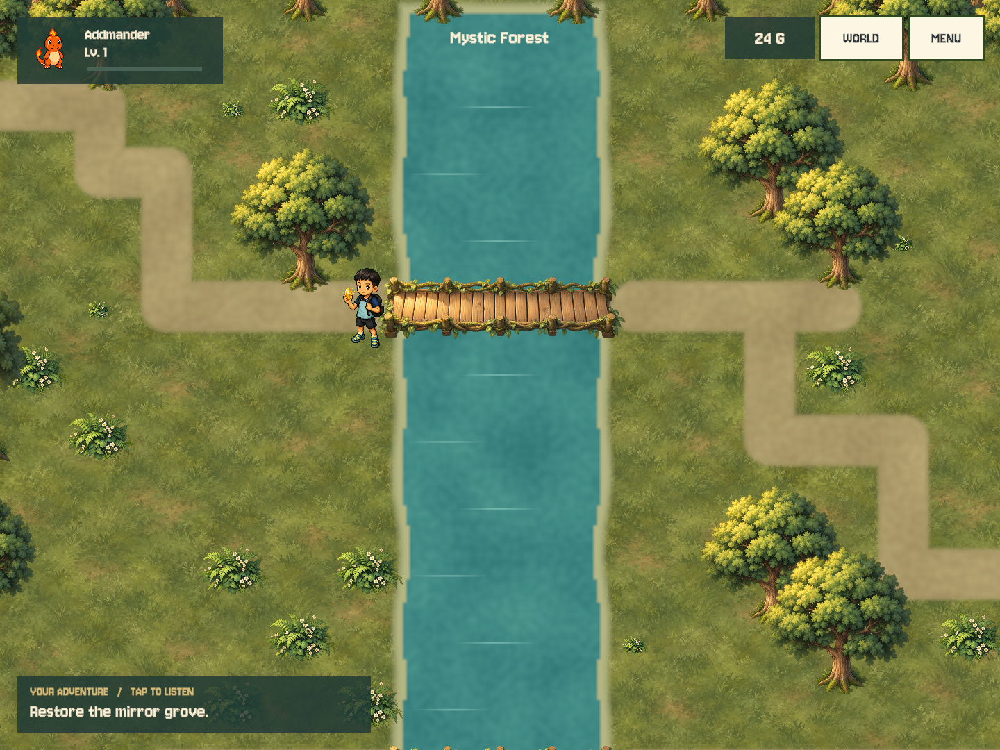
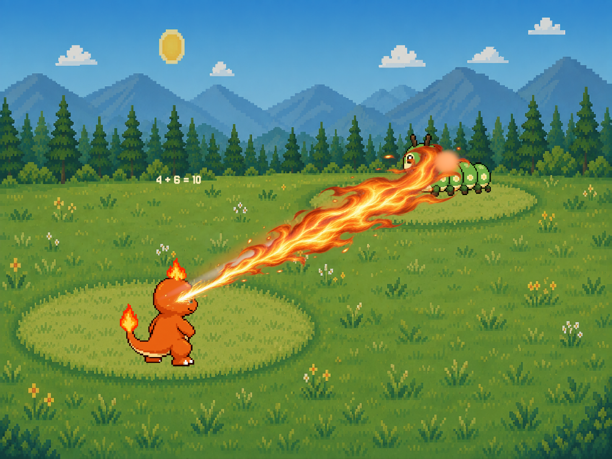
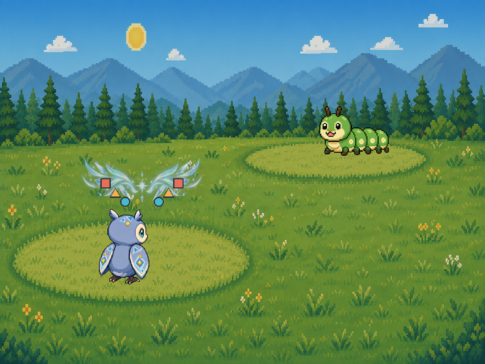

# Forest presentation slice — 2026-09-11

## Scope and intent

First playable implementation of the approved direction: character-scale exploration, readable UI, visible
world changes from math, and spells that express what was solved. Not a claim of AAA completion or a redesign
of all six maps. No combat-stat or arithmetic-range rebalance is included.

## Implemented

- `ForestScene`: new ground/prop resources, continuous river/path overlay, larger trees, landmark and guardian
  oaks, animated water accents and quest lights. The semantic 32×18 grid remains the collision authority.
- First forest rune lights the firefly grove; second grows a bridge across `(14..16,5)`; third restores mirrored
  lights. The existing lower crossing keeps all objectives reachable before the shortcut opens. The fourth
  discovery and five chests remain optional rewards. Existing rewards are unchanged.
- `ForestJourney`: all three main events unlock the guardian. v9 saves whose five forest chests were already
  opened keep their previous unlock. Boss victories, currency, team growth and captured stat offsets survive.
  Chest identities no longer depend on prop coordinates. Migration is additive and idempotent, grants no rewards,
  and cannot let newly created v10 saves skip the three events by collecting treasure.
- `ExplorationHud`: battle buddy/XP, currency, current region, voiced objective, MENU and WORLD. Atlas travel uses
  existing chapter-clear flags. Existing five-region Painted Terrain rendering is retained.
- Tap destination/path feedback, blocked-tile sound, UI pointer interception and subtle avatar motion.
- `SpellTrace` transfers actual operands or shape/color tokens from puzzles. Fire combines quantities (or removes
  the subtracted group) into a flame plume; water fills 10/20-count rows and releases a wave; mirror magic reflects
  the puzzle's tokens around a symmetrical motif. No fake randomly generated equations are displayed.
- `SpellSequence`: 0–0.65s charge, travel to 1.22s impact, recovery through 1.9s; separate elemental art, synthesized
  audio, recoil, one damage callback, and explicit cancel/transform restoration. Works for the three supported
  visual kinds including Mega variants; Mega without a puzzle does not invent an equation.
- Forest guardian successive shield breaks use make-ten, patterns, then mirror order. This changes the puzzle
  sequence, not enemy statistics, and does not guarantee the fight lasts three breaks. Wrong answers retain the
  existing base-power/no-extra-HP-penalty rules.
- Six new objective narration files are baked locally; music selections remain unchanged.

## Generated assets

All four PNGs were produced with the **built-in imagegen tool**, not the API/CLI fallback, and copied into
`unity/Assets/Resources/generated/Exploration/`. Alpha was preserved; code slices the prop and spell atlases
using their actual delivered regions. Generated artwork is not represented as third-party Painted Terrain art.

Production prompt briefs (same intended palette/perspective across the environment set):

1. `forest_props.png`: transparent 2×2 atlas for original Numeria storybook RPG; separated oak upper left,
   giant hollow glowing oak upper right, fern lower left, moss boulder lower right; 45-degree top-down, warm
   painterly brushwork, upper-left light; no ground tiles, text, grid or checkerboard. Actual atlas margins require
   the custom normalized sprite rectangles in `ForestScene.Prop`, not equal quadrants.
2. `forest_ground.png`: seamless square low-contrast moss-grass ground texture, warm hand-painted storybook
   style; no objects, path, directional shadow, lettering or border. Runtime overlays supply paths and water.
3. `spell_materials.png`: transparent atlas with three separated horizontal bands: long right-pointing flame
   plume, right-pointing curling water crest, cyan mirrored magical fan around a central star. Clean isolated
   silhouettes; no numbers, UI icons, characters or text. Runtime supplies quantities and shapes, never baked text.
4. `vine_bridge.png` final prompt:

   > Use case: stylized-concept. Asset type: transparent 2D RPG environment sprite for Numeria, a warm storybook
   > forest. Create one isolated wooden footbridge entwined with living green vines, viewed from top-down at
   > 45 degrees. Bridge runs perfectly horizontally left to right, broad readable tan planks, low mossy twisted
   > vine railings along its top and bottom edges, warm upper-left lighting, charming hand-painted soft brushwork
   > and clean silhouette, sage green leaves, ochre wood. Entire bridge centered, approximately 3:1 wide silhouette,
   > generous transparent margin, no water, no ground, no backdrop, no text, no character, no checkerboard,
   > no border. Real transparent alpha background. This is a production cutout game prop, not a scene.

## Verification

- Full Unity EditMode suite: **140/140**; Node prototype suite: **15/15**.
- Added coverage for v9 migration/idempotence/no duplicate rewards, retained guardian unlock and captured HP
  offset, new-game event gating, bridge reachability, asset presence/slicing, all three spell kinds and cancellation.
- `Numeria → Preview Forest Slice` exports deterministic 1440×1080 renders into `/tmp/numeria-forest-preview`.
  Uses actual shared forest/HUD/spell code and fresh in-memory Progress only; never calls SaveSystem.
  Spell previews sample charge/impact, omit combat HUD, and are **editor renders**, not recordings of a played fight.
- `Numeria → Export Map Previews` also routes forest through the new renderer; all other region renderers unchanged.
- Checked forest entry/restored bridge plus fire, water and mirror renders. Fixed river internal grid seams and
  replaced non-rendering custom UI ribbons with sprite-based effects during visual iteration.

## Save safety and rollback

Before changes, the entire local Numeria save directory was copied to
`~/Documents/Numeria Save Backups/2026-09-11-before-forest-slice/Numeria`.
The live slot1 and backup slot1 SHA-256 matched:
`657d723d8e8475e95b8dcb64fc612ac33f56e4c0e3c078e8ed5271d7691ceef5`.
No real slot was loaded/saved by verification.

Revert this feature commit with `git revert <feature-commit>` to restore code/assets. **Code rollback is not a
save downgrade**: the old importer rejects v10 portable saves. If rolling back after playing the new version,
first separately preserve all newer save slots; restore the pre-upgrade backup only with the player's approval.
Do not automatically replace Lucas's progress, delete save directories, or edit a schema number to bypass validation.

## Remaining quality work / acceptance checklist

- Play through a new spare slot: tap HUD without movement; walk around/through the repaired bridge; solve and retry
  all events; leave/reload; check single rewards and guardian access; travel between unlocked regions.
- Import a copied old save into a spare slot on a test device and compare team, stats, chests, crystals and coins.
- Physical iPad touch targets, aspect ratios, audio mix, memory/frame time and the new build/signing pass remain open.
- The forest still follows the old block-based topology: the river is straight, paths broad, repeated trees visible.
  Next art pass should author curved banks, richer room-like clearings and environmental storytelling.
- Avatar movement is bob/squash, not a directional walk cycle. Environment/character/battle-background resolutions
  still differ; silhouettes and brush/detail density need another coherent art pass.
- Remaining five chapters and skill families still need their own authored themes/animations. No generic recolor
  is presented as a completed bespoke skill. Guardian phases need richer tells and encounter playtesting.
- Discoveries still use shared puzzle overlays rather than fully in-world manipulation. The atlas is a functional
  chapter-card selector, not yet a continuous illustrated world map.
