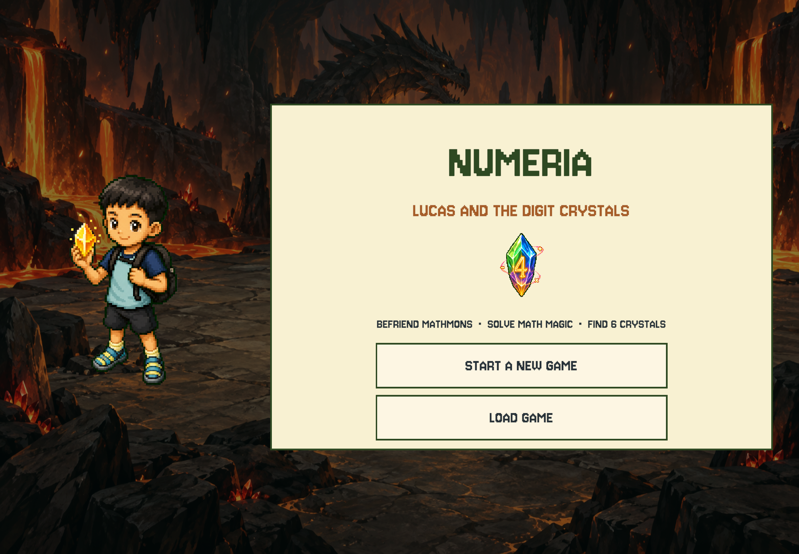

# iPad startup: missing runtime font shader

## Root cause (2026-09-12)

The first iPad installation opened with a partial map against the default blue camera background,
an empty buddy portrait, and no title/menu/text. Installing and launching the process was not sufficient
to validate that build.

Captured device console showed `ArgumentNullException: shader` in
`TMP_FontAsset.CreateFontAssetInstance → Ui.DefaultTmpFont → Ui.Label → ExplorationHud → MapController.Awake`.
The exception interrupted `BuildHud`, so the later camera setup, portrait refresh and title screen never ran.
The underlying save and map assets were intact.

`Ui` creates a Jersey 10 SDF font dynamically. TMP uses `Shader.Find("TextMeshPro/Mobile/Distance Field")`,
but no serialized material referenced that shader and it was absent from Always Included Shaders.
It was available in the Editor and stripped from the iOS player. See
[Unity Shader.Find documentation](https://docs.unity3d.com/ScriptReference/Shader.Find.html).

## Fix and regression protection

- Explicitly retain the existing `TMP_SDF-Mobile.shader` in `GraphicsSettings.asset`.
- iOS build preprocessing refuses to build if that required shader is no longer explicitly included.
- Tests assert the serialized build inclusion, not merely Editor `Shader.Find`, and construct/render runtime text.
- No save schema, font style, battle rules or map data changes.

## Verification

- Unity EditMode: **153/153 passed**; Node prototype: **15/15 passed**.
- New export's asset report explicitly includes `Assets/TextMesh Pro/Shaders/TMP_SDF-Mobile.shader`.
- Export: local ignored `unity/Builds/iOS/Numeria-4`; native output uses a fresh
  `unity/Builds/iOS/DerivedData-fontfix-20260912` directory and the paired physical iPad destination.
- Original device error log: `/tmp/numeria-ipad-runtime-diagnosis.log`.
- Build/test logs: `/tmp/numeria-ios-fontfix-export.log`, `/tmp/numeria-xcode-fontfix-build.log`,
  `/tmp/numeria-ipad-font-tests.xml`.
- A separate copy of the iPad Documents directory was made before restarting the broken app.
  Installation must be an in-place update; never uninstall or re-import an older Mac snapshot to fix rendering.

- Signed Release arm64 build passed deep/strict signature verification and was installed in place.
- All four iPad save files were read back after installation and matched the pre-fix device backup byte-for-byte.
- A physical iPad screenshot captured through Xcode confirms the complete title screen, Jersey text,
  character art and enabled LOAD GAME button are restored. This is a device capture, not an Editor preview.
- The user loaded Slot 2 on the physical iPad and confirmed the map, Lv.43 and 493 coins display normally.
  A full save/relaunch cycle and extended gameplay/performance have not been verified in this fix.

