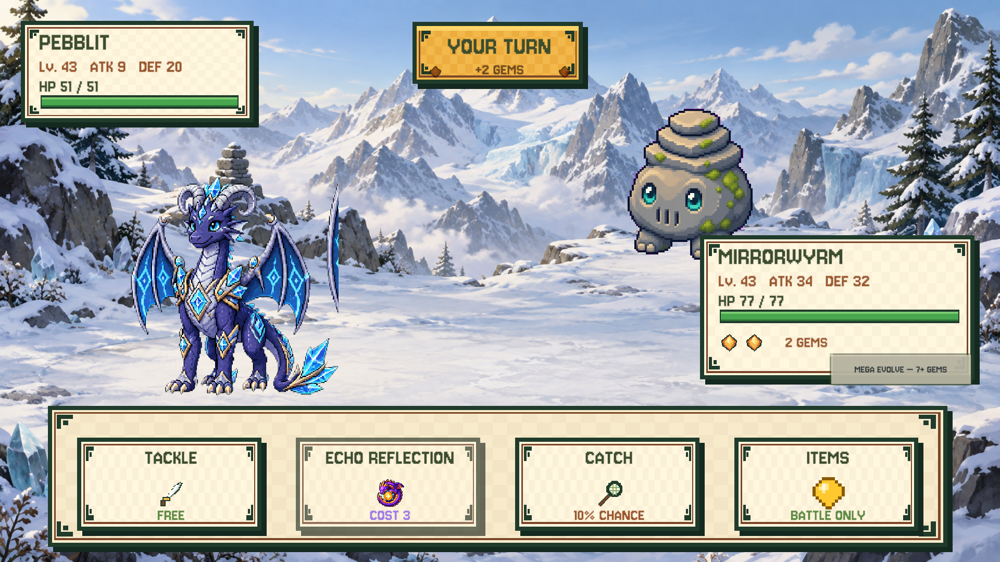

# Silent Peaks battle background correction

Date: 2026-09-11 (local).

The full-world rollout changed exploration rendering, but `Maps.Mountains().BattleBg` still selected the old
`Art/Backgrounds/mountain-battle` placeholder. Its flat mountain silhouettes and green floor did not represent
Silent Peaks. This change explicitly points mountain-region battles at the new snowy alpine panorama.

- Asset: `unity/Assets/Resources/generated/Backgrounds/Painted/Silent_Peaks.png`.
- Generated with built-in ImageGen (not the CLI/API fallback); exact prompt below.
- Snow peaks, blue glaciers, snow-laden pines, cairn and ice crystals provide the regional identity.
- Packed-snow clearings leave space for both combatants and the spell trajectory; no UI is baked into the image.
- The painted-background directory imports as Bilinear, uncompressed, full-rect sprites at 100 PPU.
- Painted battle backgrounds use aspect-preserving cover/crop rather than stretching. Other battle art is unchanged.
- Old placeholder retained for reversible rollback. No map layout, combat stats, save data or progress changes.

## Validation

`Numeria → Preview Silent Peaks Battle` renders the real `BattleController` with fresh in-memory Mirrorwyrm and
Pebblit data at 4:3, 16:9 and the reported wide ratio. It does not read or write Lucas's slots. Preview stats are
synthetic, not a copy of the player's captured individual stats.

The regression test verifies the chapter's resource selection, successful import, minimum resolution, filtering
and image ratio, and checks all six chapter battle backgrounds load. Unity EditMode: **146 passed, 0 failed**.
No physical iPad testing is claimed.

## Exact generation prompt

Use case: stylized-concept.
Asset type: production full-screen 2D turn-based creature-battle background for Numeria, Silent Peaks region. Landscape 16:9, opaque, high resolution.
Primary request: an exquisite, inviting snow-covered alpine battle clearing with a strong Silent Peaks identity. Hand-painted storybook RPG art with crisp readable shapes and carefully painted natural texture, consistent with warm painterly fantasy exploration assets; not photorealistic, not crude pixel blocks.
Scene: layered towering jagged snowy mountains in the upper middle distance, blue glacier faces, a few snow-laden dark-teal alpine pines at the outer edges, pale turquoise ice and wind-sculpted snowbanks, a small weathered stone cairn and restrained cyan crystals near the edges. A bright tranquil high-altitude morning with warm ivory sunlight on cold blue shadows, delicate distant mist, clean blue sky. No meadow or green grass.
Composition for existing gameplay UI: empty spacious battle floor across the middle/lower scene, a broad subtle oval of packed snow in the foreground centered around x28%, y68% from top, a smaller subtle packed-snow shelf centered around x69%, y46% for the opponent. Both are naturally integrated into one continuous snow clearing, not disconnected floating discs. Keep the region between them uncluttered for spell effects. Major recognizable mountain silhouettes around the center at y24-42%; quiet sky behind the top-left status panel and top-center turn banner. The bottom24% will be covered by command buttons, the rightmost28% at y40-70% by a status panel: do not hide the only interesting scenery there. Maintain readable low-contrast snow behind creature silhouettes. Gentle slightly elevated side-on battle perspective, NOT overhead map or isometric board.
Constraints: background environment ONLY, no creatures, humans, UI, frames, text, letters, numbers, logos, watermarks, thick outlines, giant foreground objects or excessive glare. Painted detail must be visible without visual noise. No blizzard obscuring the battlefield.
