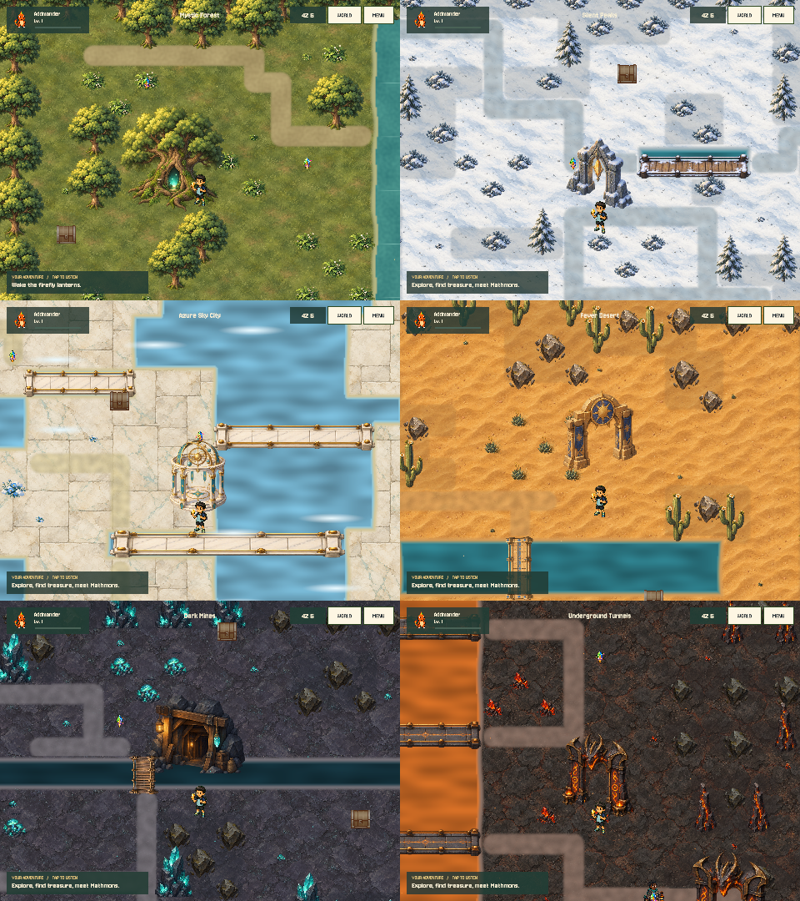
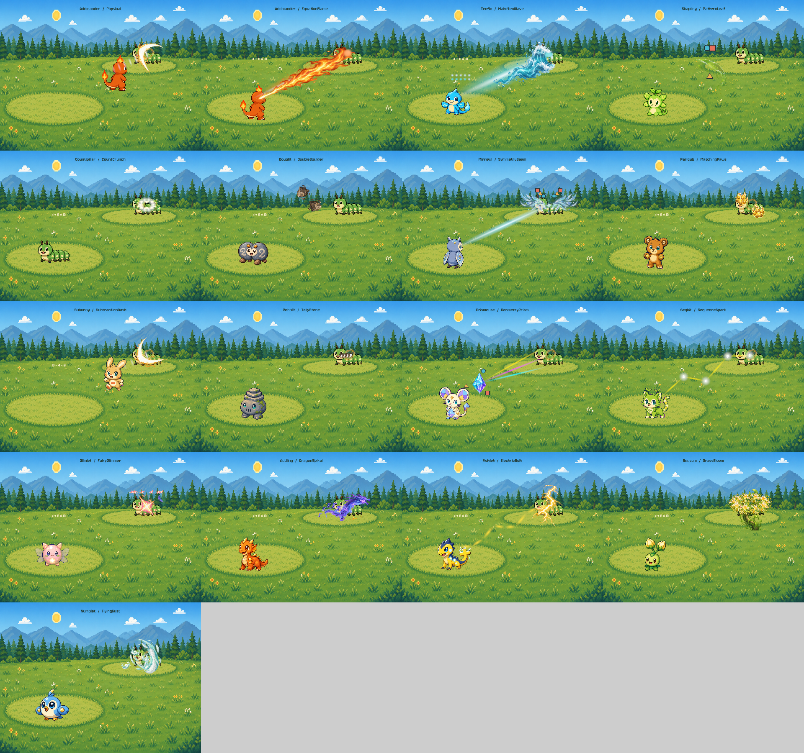
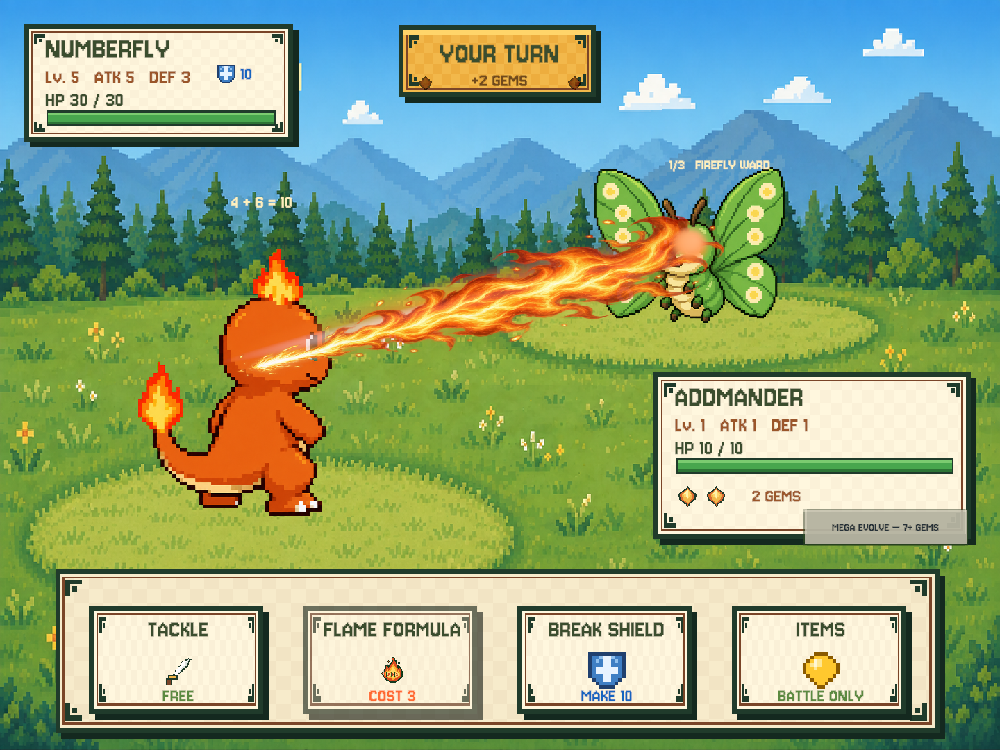

# Six-world and full-roster presentation rollout

Date: 2026-09-11 (local). This extends the [forest slice](forest-slice.md), not the game rules or save format.

## Coverage

All six regions use the character-scale environment layer. All 141 normal forms across 48 evolution families
resolve to supported spell timelines, including their two normal actions and Mega action (423 configured player
action slots). Tackle, enemy attacks and boss attacks also use the timeline system. There are **17 authored visual
kinds**, not 141 independently drawn animations: related species share choreography, with evolution-stage scale
and additional Mega resonance. The [per-species CSV](skill-animation-coverage.csv) records the actual definitions.

| Region | Environment identity |
|---|---|
| Mystic Forest | Painted woodland, great oak, fireflies and puzzle-restored vine bridge |
| Silent Peaks | Snow, pines, stone arch, snow-dusted timber crossings |
| Azure Sky City | Ivory marble islands, astronomical pavilion, gold-railed bridges and cloud accents |
| Fever Desert | Sand, cacti, sun gate and sandstone crossings |
| Dark Mines | Violet slate, cyan crystals, timber mine entrance and rope bridges |
| Underground Tunnels | Charcoal basalt, ember crystals, dragon gate and lava crossings |

`WorldScene` replaces the old exploration renderer for all chapters, delegating forest events to `ForestScene`.
It composites terrain surfaces, depth-sorted props, connected cardinal bridge decks and lightweight deterministic
atmospheric drift. Solved discoveries in the other five regions gain restoration rings and themed plants/crystals.
These are visual responses, not new puzzle rewards or guardian locks. Forest's three original events remain intact.

Existing 32×18 semantic layouts, collision, encounters, shops, chest/discovery identities and progression are
retained. This is a presentation rebuild, **not six newly hand-designed level layouts**. Old third-party catalogs
remain available but do not render the main exploration view. The travel atlas shares the new landmarks.

## Spell choreography

| Visual kind | Motion / impact | Math connection |
|---|---|---|
| Physical | Caster dash, slash and contact recoil | No puzzle |
| EquationFlame | Gathered embers become a directed flame | Addition/subtraction equation |
| MakeTenWave | Gathered quantities become a cresting wave | Make-target |
| PatternLeaf | Spinning leaf blade and curved pattern fan | Shape/color pattern |
| CountCrunch | Closing mandibles and counting motes | Counting |
| DoubleBoulder | Two converging rock arcs | Doubles |
| SymmetryBeam | Mirrored halves and crossing light | Mirrored pattern |
| MatchingPaws | Paired paw echoes | Equality balance |
| SubtractionDash | Dash and diminishing slash trail | Subtraction |
| TallyStone | Grouped stones rise and tumble | Number path |
| GeometryPrism | Faceted prism and colored refracted rays | Shape recognition |
| SequenceSpark | Successively lit zigzag nodes | Number sequence |
| FairyGlimmer | Orbiting stars and starfall | Make-target |
| DragonSpiral | Dragon wisp and helical trail | Arithmetic |
| ElectricBolt | Segmented, branching lightning | Arithmetic |
| GrassBloom | Rising roots and clustered bloom | Pattern |
| FlyingGust | Feathered wind and spiral trails | Number path |

The timeline lasts 1.9 seconds with one damage callback at 1.22 seconds. `Advance` guards against repeat callbacks
and catches a final hit even when a frame skips past the duration. Cancellation restores actor transforms. Both
directions are supported; enemy presentation uses the enemy species' visual kind without fabricating a solved
puzzle. Puzzle traces carry actual operands, pattern tokens or number sequences where relevant. Failed math does
not gain a success trace. Existing arithmetic ceilings and zero-penalty rules remain unchanged.

Generated artwork supplies materials; code supplies timing, trajectories, numbers, geometry and sound envelopes.
Existing soundtrack and voice preferences remain intact. A complete battle-UI check also prompted responsive
action labels/icons and a raised player plate so the Mega button clears the bottom dock at 4:3.

The contact sheet uses representative editor-supplied traces and one sample species per kind; it is not a capture
of 141 full played battles. Runtime traces come from the completed puzzle.

## Assets and verification

Fifteen new PNG assets were generated with built-in ImageGen: five biome grounds, five prop sheets, three spell
material sheets, a mandible sprite and a six-bridge sheet. Existing forest/fire/water/mirror resources are reused.
See [exact prompts and provenance](world-presentation-assets.md). The first isometric bridges did not align with
cardinal movement, so runtime crossings use the later top-down sheet. Count Crunch uses mandibles, not paw art.

- Unity EditMode: **145 passed, 0 failed**. Includes full-roster normal/Mega support, every enum value, materials,
  both attack directions, single-hit timing, cancellation, map reachability and no renderer mutation of grid/save data.
- Node prototype: **15 passed, 0 failed**.
- Six 1440×1080 map previews and charge/travel/impact samples for all 17 visual kinds reviewed offscreen.
- Complete 4:3 battle UI rendered through `BattleController` and checked for overlay/button clipping.
- No physical-iPad playtest, GPU/memory profiling, listening review or complete end-to-end playthrough this round.

Reproduce with **Numeria → Preview All Worlds and Skills**. Output: `/tmp/numeria-world-presentation`.
It uses fresh in-memory progress, not Lucas's save slots. Batch export needs graphics enabled; do not add
`-nographics`. **Numeria → Export Map Previews** remains available for full-map rather than character-scale views.

## Save safety and rollback

This change does not alter schema **v10**, combat stats, catching, XP or real save files. The pre-slice save backup
remains at `/Users/yuankunxue/Documents/Numeria Save Backups/2026-09-11-before-forest-slice/Numeria`.
Slot 1 was checked against its pre-work SHA-256:
`657d723d8e8475e95b8dcb64fc612ac33f56e4c0e3c078e8ed5271d7691ceef5`.

To roll back this rollout, `git revert` its feature commit. This leaves the previous forest-slice code and v10
compatibility intact. Do not start a new game, reset progress or overwrite slots to verify an art change.
Rolling back the older schema-changing forest commit is a separate operation with its own documented caveat.

## Remaining art direction work

The maps retain rectilinear gameplay topology; shorelines and routes need further hand-authored shaping and local
story scenes. Painterly environments still coexist with pixel character/UI assets. Character walk cycles,
individual species-specific finishing moves, stronger camera direction and device-budget tuning remain future
work. This delivers full coverage of the established presentation direction, not first-tier RPG production polish.
